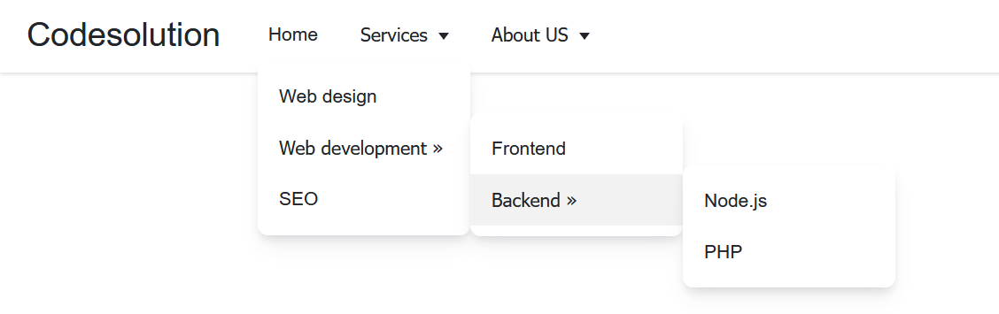

# Multilevel dropdown menu creating in ReactJS
Multilevel dropdown menus are a staple of web design. With the ability to provide multiple options to select from, they make navigation bars dynamic and organized.

# Screenshot
Here is project screenshot :

